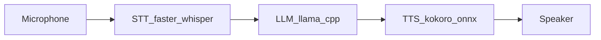
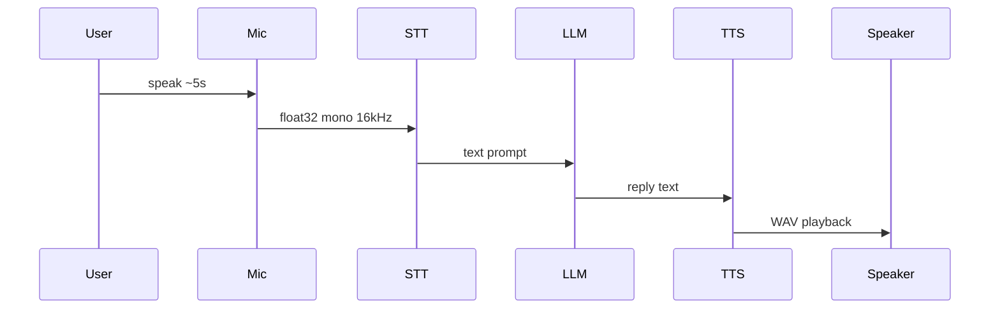

# Architecture overview (chapter 00)

This chapter runs a **blocking** pipeline: each stage finishes before the next starts. Later chapters add **streaming** and **full-duplex** behavior.

## Data flow (high level)

See also the diagram in the repo: [diagrams/data-flow.png](../diagrams/data-flow.png).

## Sequence: `run_first_voice_agent.py`

## Library layout (`src/voice_agents/`)

| Area | Role |
|------|------|
| `audio/` | Record + play |
| `stt/` | `faster-whisper` wrappers |
| `tts/` | Kokoro → WAV |
| `agent/` | Qwen-style chat prompt + `llama-cpp-python` |
| `tools/` | Pydantic + JSON Schema (chapter 07) |

## State and memory

Chapter 00 uses a **single turn** (one recording). `PromptEngine` in the library can hold **short memory strings** for multi-turn demos in later chapters. A **TTL session store** (`SessionStore`) supports future web / multi-user flows (chapter 10).
