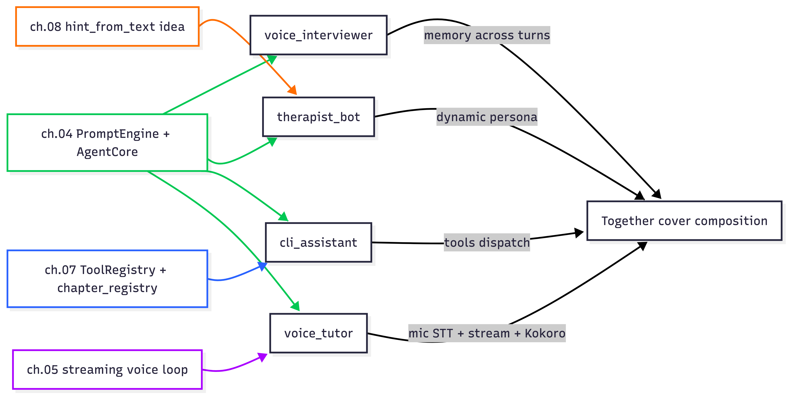

# Chapter 09 - Projects

**Why this chapter exists:** Earlier chapters built **layers** (audio, STT, LLM, TTS, tools, persona). Chapter 09 shows **composition**: each subfolder demonstrates **one glue skill** - how to attach the library pieces into something product-shaped **without** fine-tuning weights.

**How to read the diagram:** boxes are **prior chapters**; arrows show **what each capstone imports or mirrors**.



**Composition matrix**  -  each row is one lesson; together they cover how a voice-agent codebase usually grows.

| Project | Memory | Dynamic persona | Tools | Mic + STT + TTS |
|---------|:---:|:---:|:---:|:---:|
| [`voice_interviewer`](#voice_interviewervoice_interviewerpy) | yes |  -  |  -  |  -  |
| [`therapist_bot`](#therapist_bottherapist_botpy) | yes | yes |  -  |  -  |
| [`cli_assistant`](#cli_assistantcli_assistantpy) |  -  |  -  | yes |  -  |
| [`voice_tutor`](#voice_tutorvoice_tutorpy) |  -  |  -  |  -  | yes |

**`therapist_bot` disclaimer:** the script is a **teaching sketch** for prompts + memory. It is **not** therapy, crisis support, or medical advice.

**Previous:** [Chapter 08 - Personality](../08_personality/README.md).

---

## Table of Contents

- [At a glance](#at-a-glance)
- [Prerequisites](#prerequisites)
- [One-command Llama GGUF download](#one-command-llama-gguf-download)
- [Suggested order](#suggested-order)
- [What each example does](#what-each-example-does)
- [Troubleshooting](#troubleshooting)
- [How this ties to the library](#how-this-ties-to-the-library)
- [Previous](#previous)
- [Next](#next)

---

## At a glance

| | |
|---|---|
| **Dependencies** | `uv sync`. **`voice_interviewer`** uses the **Qwen2.5** GGUF from [chapter 00](../00_start_here/README.md). **`voice_tutor`**, **`therapist_bot`**, and **`cli_assistant`** use a **Llama 3.x instruct** GGUF (see [`llama_gguf.py`](./llama_gguf.py)). **`voice_tutor`** also needs **Whisper** + **Kokoro**. **`cli_assistant`** may use **network** for **`weather`** / **`search`**. |
| **Done looks like** | **`voice_interviewer` / `therapist_bot` / `cli_assistant`:** assistant text **streams** to the terminal (token chunks via [`stream_util.py`](./stream_util.py) + [`AgentCore.stream_tokens`](../src/voice_agents/agent/agent_core.py)). **`cli_assistant`** streams the router JSON, then the summary. **`voice_tutor`:** after a **one-time preload** (Whisper + Llama + Kokoro), **multi-turn** mic → STT → **streamed** tutor speech (sentence-chunked TTS); say **quit** / **exit** / **goodbye** alone to stop. **`--text`** = single text turn, then exit. |

---

## Prerequisites

1. **Environment**  -  From the repository root: `uv sync`.
2. **Models**  -  Run [`00_start_here/download_models.py`](../00_start_here/download_models.py) for **Qwen** (used by **`voice_interviewer`** only in this chapter) plus Whisper + Kokoro for **`voice_tutor`**. For **`voice_tutor`**, **`therapist_bot`**, and **`cli_assistant`**, you need a **Llama 3.x instruct** GGUF under **`models/llm/`**  -  filenames tried first are listed in [`09_projects/llama_gguf.py`](./llama_gguf.py). Those scripts set **`AgentCore(chat_template="llama3")`**; the Qwen chat template would be wrong for Llama weights.
3. **Optional reads**  -  [`PromptEngine`](../src/voice_agents/agent/prompt_engine.py), [`AgentCore`](../src/voice_agents/agent/agent_core.py) (**`chat_template`**, **`llama3_instruct_chat_prompt`**), [`chapter_registry.py`](../07_tools/chapter_registry.py).

### One-command Llama GGUF download

From the **repository root**, this pulls **`Meta-Llama-3.1-8B-Instruct-Q4_K_M.gguf`** (Llama **3.1** 8B **Instruct**, **Q4_K_M** quant) from the **`bartowski/Meta-Llama-3.1-8B-Instruct-GGUF`** repo into **`models/llm/`**  -  the same filename [`llama_gguf.py`](./llama_gguf.py) tries first:

```bash
uv run python 09_projects/download_llama_8b_instruct_gguf.py
```

Override repo or filename if you mirror elsewhere: `uv run python 09_projects/download_llama_8b_instruct_gguf.py --help`.

---

## Suggested order

Smallest new concept first; **`voice_tutor`** last as the full **audio** capstone.

| Order | Script | Composition skill |
|------:|--------|---------------------|
| 1 | [`voice_interviewer/voice_interviewer.py`](./voice_interviewer/voice_interviewer.py) | Shared **`PromptEngine`** → **`memory_lines`** across turns |
| 2 | [`therapist_bot/therapist_bot.py`](./therapist_bot/therapist_bot.py) | Same engine + **rewrite `system_prompt`** each turn (`hint_from_text`) |
| 3 | [`cli_assistant/cli_assistant.py`](./cli_assistant/cli_assistant.py) | **`chapter_registry`** + router JSON + **`reg.call`** + summarizer |
| 4 | [`voice_tutor/voice_tutor.py`](./voice_tutor/voice_tutor.py) | Chapter **05** streaming loop + **tutor** persona only |

---

## What each example does

From the **repository root** (after `uv sync`).

### `voice_interviewer/voice_interviewer.py`

**Source:** [`voice_interviewer.py`](./voice_interviewer/voice_interviewer.py)  -  **Learning deeper:** [`voice_interviewer/CODE.md`](./voice_interviewer/CODE.md)

Behavioral interview REPL. **`Candidate`** prompt; **`Interviewer`** replies **stream** to the console and use earlier turns via **`PromptEngine.build_user_message`**. This script keeps the repo default **Qwen2.5** GGUF from chapter 00 (**`chat_template="qwen25"`** on [`AgentCore`](../src/voice_agents/agent/agent_core.py)).

```bash
uv run python 09_projects/voice_interviewer/voice_interviewer.py
```

---

### `therapist_bot/therapist_bot.py`

**Source:** [`therapist_bot.py`](./therapist_bot/therapist_bot.py)  -  **Learning deeper:** [`therapist_bot/CODE.md`](./therapist_bot/CODE.md)

Supportive-listener **sketch** (not clinical). Each turn shows **`(hint -> …)`** from a toy keyword map (same idea as [chapter 08 `emotional_responses`](../08_personality/emotional_responses/emotional_responses.py)); the reply **streams** token-by-token. Loads a **Llama 3.x instruct** GGUF via [`llama_gguf.py`](./llama_gguf.py) with **`chat_template="llama3"`**.

```bash
uv run python 09_projects/therapist_bot/therapist_bot.py
```

---

### `cli_assistant/cli_assistant.py`

**Source:** [`cli_assistant.py`](./cli_assistant/cli_assistant.py)  -  **Learning deeper:** [`cli_assistant/CODE.md`](./cli_assistant/CODE.md)

Tools REPL: model **streams** **one JSON tool call** → **`ToolRegistry.call`** → second pass **streams** the user-facing summary. **`--calc-only`** registers **calc** only (easier when the router JSON drifts). Uses a **Llama 3.x instruct** GGUF (**`chat_template="llama3"`**); paths in [`llama_gguf.py`](./llama_gguf.py).

```bash
uv run python 09_projects/cli_assistant/cli_assistant.py
uv run python 09_projects/cli_assistant/cli_assistant.py --calc-only
```

---

### `voice_tutor/voice_tutor.py`

**Source:** [`voice_tutor.py`](./voice_tutor/voice_tutor.py)  -  **Learning deeper:** [`voice_tutor/CODE.md`](./voice_tutor/CODE.md)

**Default:** loads **Whisper**, **Llama**, and **Kokoro** once (dummy transcribe + **`preload()`** + dummy **`create`**) so the **first** real question is faster, then **loops**: record (**`--seconds`**, default 5) → STT (reuses one **`WhisperModel`**) → stream LLM → Kokoro by sentence. One shared **`PromptEngine`** keeps **memory** across turns. Stop when the transcript is exactly **quit** / **exit** / **goodbye** (case-insensitive) or **Ctrl+C**. **`--text "…"`** = one text turn, no mic, then exit. LLM: **Llama 3.x instruct** + **`chat_template="llama3"`** (see [`llama_gguf.py`](./llama_gguf.py)).

```bash
uv run python 09_projects/voice_tutor/voice_tutor.py
uv run python 09_projects/voice_tutor/voice_tutor.py --seconds 8
uv run python 09_projects/voice_tutor/voice_tutor.py --text "Explain recursion with a tiny example."
```

---

## Troubleshooting

- **Missing Qwen GGUF (`voice_interviewer`)**  -  Run [`download_models.py`](../00_start_here/download_models.py); confirm **`models/llm/qwen2.5-0.5b-instruct-q4_k_m.gguf`** exists.
- **No Llama GGUF (`voice_tutor` / `therapist_bot` / `cli_assistant`)**  -  Install one of the files listed in [`llama_gguf.py`](./llama_gguf.py) under **`models/llm/`**, or add your filename to **`LLAMA_INSTRUCT_FILENAMES`** there (must stay Llama **3.x instruct**-compatible with **`chat_template="llama3"`**).
- **`voice_tutor`: missing Whisper/Kokoro paths**  -  Same as [chapter 05](../05_full_voice_loop/README.md): full **`models/`** download from chapter 00.
- **No mic / bad recording**  -  Use **`--text`**; see [chapter 01](../01_audio_io/README.md) if you want to debug capture.
- **No playback / wrong device**  -  [chapter 01](../01_audio_io/README.md) output troubleshooting.
- **`cli_assistant` slow per line**  -  Two **`complete`** calls (router + summary). **`--calc-only`** shrinks router schema; tiny models may still emit invalid JSON - compare with [`07_tools/llm_tool_loop`](../07_tools/llm_tool_loop/llm_tool_loop.py).
- **`cli_assistant` HTTP / tool errors**  -  **`weather`** / **`search`** need network; failures surface from the tool implementation.
- **`ModuleNotFoundError: voice_agents`**  -  Run with **`uv run python ...`** from repo root.
- **`Import` / `chapter_registry` issues**  -  Script inserts **`07_tools/`** on **`sys.path`** (same pattern as chapter 07); run paths as shown above.

---

## How this ties to the library

- **[`PromptEngine`](../src/voice_agents/agent/prompt_engine.py)**  -  **`system_prompt`**, **`memory_lines`**, **`build_user_message`**.
- **[`AgentCore`](../src/voice_agents/agent/agent_core.py)**  -  **`stream_tokens`** in all chapter 09 scripts (terminal streaming via [`stream_util.py`](./stream_util.py); **`voice_tutor`** additionally streams into Kokoro sentence chunks). **`chat_template="qwen25"`** (**`voice_interviewer`**) vs **`"llama3"`** (**`voice_tutor`**, **`therapist_bot`**, **`cli_assistant`**) so the prompt wrapper matches the GGUF family.
- **Audio / STT**  -  [`record_seconds`](../src/voice_agents/audio/audio_input.py), [`transcribe_samples`](../src/voice_agents/stt/streaming_stt.py), [`play_float_mono`](../src/voice_agents/audio/audio_output.py).
- **Tools**  -  [`ToolRegistry`](../src/voice_agents/tools/registry.py), [`07_tools/chapter_registry.py`](../07_tools/chapter_registry.py), reference loop [`07_tools/llm_tool_loop/llm_tool_loop.py`](../07_tools/llm_tool_loop/llm_tool_loop.py).
- **Persona / tone toy**  -  [`08_personality/emotional_responses/emotional_responses.py`](../08_personality/emotional_responses/emotional_responses.py) (`hint_from_text` source for **`therapist_bot`**).

---

## Previous

[Chapter 08 - Personality](../08_personality/README.md)

---

## Next

[Chapter 10 - Modal deployment](../10_deployment/README.md)
