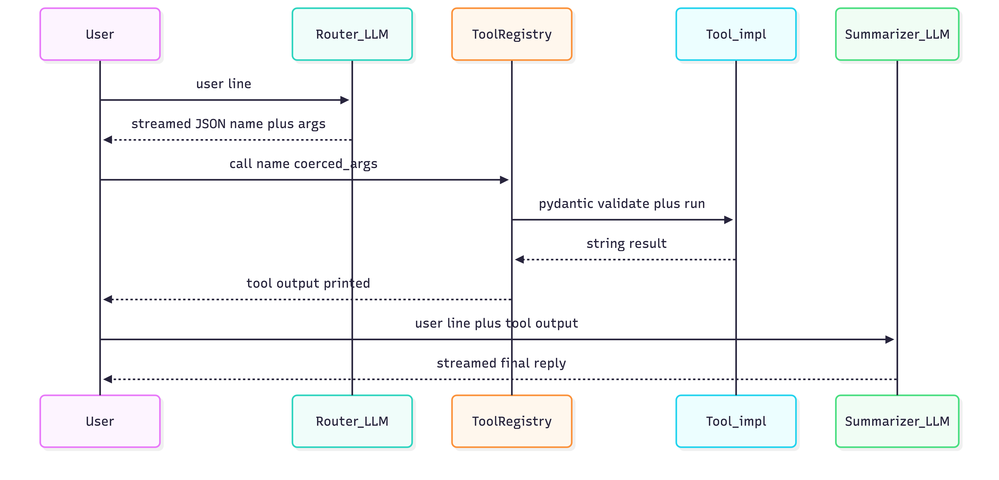

# CLI Assistant

## Purpose

This capstone is a **text REPL** where every line you type triggers a **two-stage LLM pipeline**: first the model must emit **strict JSON** naming a tool and its arguments, then a **second** completion turns the **tool’s string output** into a short, user-facing answer.

That is the same **pattern** as [`07_tools/llm_tool_loop/llm_tool_loop.py`](../../07_tools/llm_tool_loop/llm_tool_loop.py), but here you stay inside a **Rich** `>` loop so it feels like a tiny “assistant product.” The teaching goals are:

1. **Separation of concerns**  -  routing (which tool?) vs summarization (how do I say it?) use **different system prompts** and **different temperatures**, but one shared [`AgentCore`](../../src/voice_agents/agent/agent_core.py).
2. **Schema discipline**  -  the router sees **JSON Schemas** for every registered tool; small models often fail unless you shrink the schema (`--calc-only`).
3. **Robustness at the boundary**  -  real models wrap JSON in markdown fences or nest `expression` oddly; **`_extract_json_object`** and **`_coerce_tool_arguments`** are the glue between “LLM output” and **`ToolRegistry.call`**.

### Why not one LLM call?

You *could* ask the model to “call a tool and answer in one breath,” but then you must parse **narration + JSON** mixed together, or trust free-form tool use. The **router → execute → summarizer** split keeps **execution** on typed Python (**Pydantic** on the tool boundary) and uses the LLM only where language is hard (routing language, summarizing raw tool text).



---

## How this fits the rest of the repo

| Piece | Chapter 09 here | Earlier reference |
|--------|------------------|-------------------|
| Tool registry | [`build_registry()`](../../07_tools/chapter_registry.py) (or calc-only inline registry) | [`07_tools/llm_tool_loop`](../../07_tools/llm_tool_loop/llm_tool_loop.py) |
| JSON extraction / coercion | Duplicated **on purpose** in this file so it runs standalone | Same helpers in `llm_tool_loop` (read that `CODE.md` for line-by-line coercion notes) |
| LLM weights | **Llama 3.x instruct** GGUF, [`resolve_llama_instruct_gguf`](../llama_gguf.py), `chat_template="llama3"` | Chapter 05 demos often use **Qwen** + `qwen25` from chapter 00 |
| Streaming to terminal | [`stream_reply_to_console`](../stream_util.py) | Thin wrapper over [`AgentCore.stream_tokens`](../../src/voice_agents/agent/agent_core.py) |

---

## Run

```bash
uv run python 09_projects/cli_assistant/cli_assistant.py
```

If the model keeps emitting invalid JSON or wrong nesting on **`calc`**, shrink the tool list:

```bash
uv run python 09_projects/cli_assistant/cli_assistant.py --calc-only
```

**Exit:** empty line, `quit`, or `exit`.

**Network:** `weather` and `search` tools may perform HTTP calls (see each tool under [`07_tools/`](../../07_tools/)).

---

## Prerequisites

| Asset | Role |
|--------|------|
| **Llama 3.x instruct GGUF** under `models/llm/` | Matched by filename list in [`09_projects/llama_gguf.py`](../llama_gguf.py). One-shot download helper: [`09_projects/download_llama_8b_instruct_gguf.py`](../download_llama_8b_instruct_gguf.py) (if present in your tree). |
| **`uv run python …`** from **repo root** | So `voice_agents` and `07_tools` imports resolve. |

---

## Dependencies (reading map)

| Symbol | File | Role |
|--------|------|------|
| `resolve_llama_instruct_gguf` | [`llama_gguf.py`](../llama_gguf.py) | Picks first existing Llama instruct GGUF on disk. |
| `stream_reply_to_console` | [`stream_util.py`](../stream_util.py) | Prints streaming tokens; returns **full** assistant string for JSON parsing. |
| `build_registry` | [`chapter_registry.py`](../../07_tools/chapter_registry.py) | Registers **calc**, **time**, **weather**, **search** with JSON Schemas. |
| `AgentCore` | [`agent_core.py`](../../src/voice_agents/agent/agent_core.py) | Loads GGUF; `chat_template="llama3"` selects prompt + stop tokens. |
| `PromptEngine` | [`prompt_engine.py`](../../src/voice_agents/agent/prompt_engine.py) | Holds `system_prompt` and `memory_lines` (cleared each sub-step in the REPL). |

---

## Code walkthrough

### 1. `sys.path` and imports from sibling folders

The script lives under `09_projects/cli_assistant/`, but it imports **`llama_gguf`** and **`stream_util`** from the **`09_projects/`** parent and **`chapter_registry`** from **`07_tools/`**. The pattern is the same as other tutorial scripts that are not installed as a package:

```22:41:09_projects/cli_assistant/cli_assistant.py
ROOT = Path(__file__).resolve().parents[2]
_CH09 = ROOT / "09_projects"
if str(_CH09) not in sys.path:
    sys.path.insert(0, str(_CH09))
from llama_gguf import resolve_llama_instruct_gguf
from stream_util import stream_reply_to_console

_CH07 = ROOT / "07_tools"
if str(_CH07) not in sys.path:
    sys.path.insert(0, str(_CH07))

from pydantic import ValidationError
from rich.console import Console
from rich.prompt import Prompt

from voice_agents.agent.agent_core import AgentCore
from voice_agents.agent.prompt_engine import PromptEngine
from voice_agents.tools.registry import ToolRegistry

from calculator_tool.calculator_tool import CalcParams, calculator_eval
from chapter_registry import build_registry
```

**Takeaway:** when you copy a script into a subfolder, decide explicitly where “shared project helpers” live (`09_projects/` here) vs chapter-specific modules (`07_tools/`).

---

### 2. Router system prompt: schemas + routing rules

`_tool_router_system_prompt` concatenates **behavioral rules** (exactly one JSON object, keys `name` and `arguments`, flat `calc.expression` as string) with **`reg.schema_list()`** serialized to JSON. When `calc_only` is false, extra bullets steer **search** as the default for “general knowledge” vs **weather** only for explicit forecast language.

See ```51:71:09_projects/cli_assistant/cli_assistant.py``` for the full string builder.

**Why temperature 0.05 on the router** (in the main loop): you want **deterministic, valid JSON** more than creative language.

---

### 3. Two engines, one `AgentCore`, cleared memory each sub-step

```216:217:09_projects/cli_assistant/cli_assistant.py
    router_engine = PromptEngine(system_prompt=router_system)
    summary_engine = PromptEngine(system_prompt=_SUMMARY_SYSTEM)
```

Both share **`agent = AgentCore(..., chat_template="llama3", n_ctx=8192)`** but **memory must not leak** between “router pass” and “summary pass,” or between REPL turns. The script therefore **`clear()`s** `memory_lines` before each stream:

```231:232:09_projects/cli_assistant/cli_assistant.py
        router_engine.memory_lines.clear()
        raw = stream_reply_to_console(
```

and again before summarization:

```262:263:09_projects/cli_assistant/cli_assistant.py
        summary_engine.memory_lines.clear()
        follow = (
```

**Contrast with [`voice_tutor`](../voice_tutor/CODE.md) / [`voice_interviewer`](../voice_interviewer/CODE.md):** those intentionally **keep** one engine’s memory across turns. Here, each `>` line is independent except for what you manually put in the summarizer’s **`follow`** string (user question + tool output).

---

### 4. Parse → coerce → `reg.call`

After the router stream, **`_extract_json_object(raw)`** strips optional markdown fences, **`json.loads`**, and as a fallback slices from first `{` to last `}` if the model prefixed junk.

**`_coerce_tool_arguments`** normalizes small-model mistakes: nested `{"expression": {"expression": "1+1"}}`, search query under `q` vs `query`, weather `town` vs `location`, string coordinates coerced to `float`, etc. This is tedious code **on purpose** - production systems often use **structured output** (tool APIs, constrained decoding) instead of free-form JSON.

Execution:

```254:258:09_projects/cli_assistant/cli_assistant.py
        try:
            tool_out = reg.call(name, coerced)
        except (KeyError, ValidationError, TypeError, ValueError) as e:
            console.print(f"[red]Tool execution failed:[/] {e}")
            continue
```

**`ValidationError`** comes from **Pydantic** models registered per tool in [`ToolRegistry`](../../src/voice_agents/tools/registry.py).

---

### 5. Summarizer prompt: grounded answer

The second call does **not** pass the raw user line alone as the semantic “question” to the summarizer’s user slot; it passes a **structured block** that quotes the tool output. That reduces the chance the model **hallucinates** facts not in the tool string.

```263:267:09_projects/cli_assistant/cli_assistant.py
        follow = (
            f"The user asked:\n{q}\n\n"
            f"The tool {name} returned:\n{tool_out}\n\n"
            "Write the final reply for the user following the system rules."
        )
```

Temperature **0.35** is slightly higher than the router so the final wording sounds natural while staying close to the tool text.

---

### 6. `--calc-only` registry

```45:48:09_projects/cli_assistant/cli_assistant.py
def _calc_only_registry() -> ToolRegistry:
    r = ToolRegistry()
    r.register("calc", CalcParams, lambda m: calculator_eval(m))
    return r
```

Use this when debugging **JSON shape** or comparing model sizes: a single tool with one schema is the smallest “router surface area.”

---

## Failure modes (what to try when it breaks)

| Symptom | Likely cause | What to try |
|---------|----------------|------------|
| `Parse/coerce failed` | Model wrapped JSON or used wrong keys | `--calc-only`; lower router `max_tokens`; tighten router prompt |
| `Tool execution failed` / `ValidationError` | Arguments still wrong after coercion | Print `raw` router output; extend `_coerce_tool_arguments` for your tool |
| Search or weather errors | Network, API keys, or rate limits | Run with network; read the specific tool module under `07_tools/` |
| `No Llama 3.x instruct GGUF` | File missing or wrong filename | Add a name to `LLAMA_INSTRUCT_FILENAMES` in [`llama_gguf.py`](../llama_gguf.py) or drop the file in `models/llm/` |

---

## Extensions (exercises)

1. **Third step:** after summary, ask the model whether another tool is needed (agentic loop)  -  watch for infinite loops; cap iterations.
2. **Logging:** write `name`, `coerced`, and `tool_out` to a file for offline analysis of router mistakes.
3. **Single `PromptEngine` with explicit reset:** instead of two engines, use one and document when you clear memory vs when you keep it.

---

## Related reading

- [`07_tools/llm_tool_loop/CODE.md`](../../07_tools/llm_tool_loop/CODE.md)  -  same JSON pipeline, Qwen-oriented reference script.
- [`04_agent_core/memory/CODE.md`](../../04_agent_core/memory/CODE.md)  -  how `memory_lines` shape the next user message via `build_user_message`.
