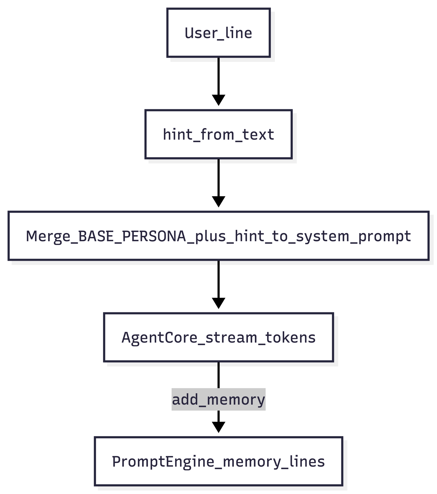

# Therapist bot (pedagogical sketch)

## Purpose

This script is a **supportive-listener** text REPL: you type after **`You`**, the assistant streams a reply, and you repeat. It is **not** therapy, crisis intervention, or medical advice - it is a **pedagogical sketch** for two combined ideas from chapter **08** and chapter **04**:

1. **Dynamic persona hints**  -  a toy function **`hint_from_text`** maps a few **keywords** in the user’s line to a short **instruction fragment** (copied from [`08_personality/emotional_responses/emotional_responses.py`](../../08_personality/emotional_responses/emotional_responses.py)). That stands in for a real **sentiment/topic classifier** or a second model pass.
2. **Mutable `system_prompt` each turn**  -  the same [`PromptEngine`](../../src/voice_agents/agent/prompt_engine.py) instance keeps **`memory_lines`** from prior turns (via [`AgentCore.stream_tokens`](../../src/voice_agents/agent/agent_core.py)), but **`engine.system_prompt`** is **rewritten** before every generation to **`BASE_PERSONA + hint`**.

So the listener **remembers** what was said (memory) while the **style directive** can change every turn (persona hint) - two axes of “behavior” that beginners often conflate.

**LLM stack:** **Llama 3.x instruct** GGUF + `chat_template="llama3"` via [`resolve_llama_instruct_gguf`](../llama_gguf.py), same as [`cli_assistant`](../cli_assistant/cli_assistant.py) and [`voice_tutor`](../voice_tutor/voice_tutor.py), unlike [`voice_interviewer`](../voice_interviewer/voice_interviewer.py) which stays on **Qwen**.



---

## Run

```bash
uv run python 09_projects/therapist_bot/therapist_bot.py
```

**Exit:** empty line, `quit`, or `exit`.

Each turn prints **`(hint -> …)`** in dim text so you can see which keyword branch ran (or the neutral default).

---

## Prerequisites

| Asset | Role |
|--------|------|
| Llama 3.x instruct GGUF under `models/llm/` | Resolved by [`llama_gguf.py`](../llama_gguf.py); extend `LLAMA_INSTRUCT_FILENAMES` if your filename differs. |

---

## Dependencies

| Piece | Role |
|--------|------|
| **`hint_from_text`** (in [`therapist_bot.py`](./therapist_bot.py)) | Toy keyword → short instruction string. |
| [`stream_reply_to_console`](../stream_util.py) | Streams assistant tokens to the Rich console. |
| `AgentCore` + `PromptEngine` | Same as other capstones; see [`agent_core.py`](../../src/voice_agents/agent/agent_core.py). |

---

## Code walkthrough

### 1. Base persona vs per-turn hint

```32:36:09_projects/therapist_bot/therapist_bot.py
BASE_PERSONA = (
    "You are a supportive listener. Reflect briefly, avoid medical claims, "
    "and suggest professional help if a crisis is mentioned."
)
```

**`BASE_PERSONA`** encodes **non-negotiable boundaries** (no medical claims; escalate language if crisis words appear - though the toy `hint_from_text` does not implement a crisis detector). **`hint_from_text`** only nudges **tone**.

```39:46:09_projects/therapist_bot/therapist_bot.py
def hint_from_text(user: str) -> str:
    # Copied from 08_personality/emotional_responses/emotional_responses.py
    low = user.lower()
    if any(w in low for w in ("sad", "sorry", "worried")):
        return "Respond with empathy and reassurance."
    if any(w in low for w in ("great", "awesome", "thanks")):
        return "Match the user's positive energy briefly."
    return "Stay neutral and helpful."
```

**Limits of keyword routing:** false positives (“I’m not **sorry** we met”) and false negatives (sarcasm, typos). The lesson is the **pipeline shape**: swap `hint_from_text` for a classifier API later without changing the merge step.

---

### 2. Merge before each generation

```65:71:09_projects/therapist_bot/therapist_bot.py
        hint = hint_from_text(user)
        engine.system_prompt = f"{BASE_PERSONA}\n\n{hint}"
        console.print(f"[dim](hint -> {hint})[/]")
        stream_reply_to_console(
            agent,
            user,
```

**Order matters:** update **`system_prompt`** **before** `stream_reply_to_console`, which calls `stream_tokens` and therefore builds the prompt from the **current** `engine.system_prompt` and **`build_user_message(user)`**.

**What does not reset:** `engine.memory_lines` is untouched by assigning to `system_prompt` - same dataclass object, different field.

---

### 3. Memory still grows across turns

Inside [`AgentCore.stream_tokens`](../../src/voice_agents/agent/agent_core.py), after all tokens are yielded, the engine receives:

- `User: {user_text}`
- `Assistant: {full_reply}`

So the **next** `build_user_message` includes prior user/assistant pairs in the **context block**, while the **system** block changes with the new hint. Conceptually:

| Layer | What changes each turn |
|--------|-------------------------|
| **System** | `BASE_PERSONA` + fresh `hint` |
| **User “slot”** (via `build_user_message`) | Latest utterance **plus** embedded transcript of earlier lines |

---

### 4. Startup: resolve GGUF + construct agent once

```49:59:09_projects/therapist_bot/therapist_bot.py
    llm_path = resolve_llama_instruct_gguf(ROOT)
    if llm_path is None:
        console.print(
            "[red]No Llama 3.x instruct GGUF under models/llm/.[/] See [cyan]09_projects/llama_gguf.py[/]."
        )
        raise SystemExit(1)

    agent = AgentCore(model_path=str(llm_path), chat_template="llama3", n_ctx=8192)
    engine = PromptEngine(system_prompt=BASE_PERSONA)
```

Initial **`PromptEngine(system_prompt=BASE_PERSONA)`** sets a valid default before the first turn’s merge; the first iteration immediately overwrites with `BASE_PERSONA + hint` anyway.

---

## Safety and product reality (read this once)

- **Crisis:** keyword lists do **not** replace **988 / local emergency / licensed professionals**. A real product needs escalation flows, moderation, and legal review.
- **Privacy:** this REPL logs to the terminal only, but any deployed version must handle **PHI**/PIPEDA/GDPR.
- **“Therapist” naming:** the filename reflects a **listener** persona, not a licensed role.

---

## Extensions

1. **Second-pass classifier:** call a tiny model or API to set `hint` (or a structured enum) instead of `in` checks.
2. **Immutable base + structured addendum:** store `hint` in `PromptEngine` as a separate field (would require extending the dataclass) to avoid string concatenation ambiguity.
3. **Voice:** reuse [`voice_tutor`](../voice_tutor/voice_tutor.py) audio path while keeping **dynamic system** updates from this file.

---

## Related reading

- [`08_personality/emotional_responses/CODE.md`](../../08_personality/emotional_responses/CODE.md)  -  full emotional tones demo and keyword table context.
- [`voice_interviewer/CODE.md`](../voice_interviewer/CODE.md)  -  memory-only variation without dynamic system text.
