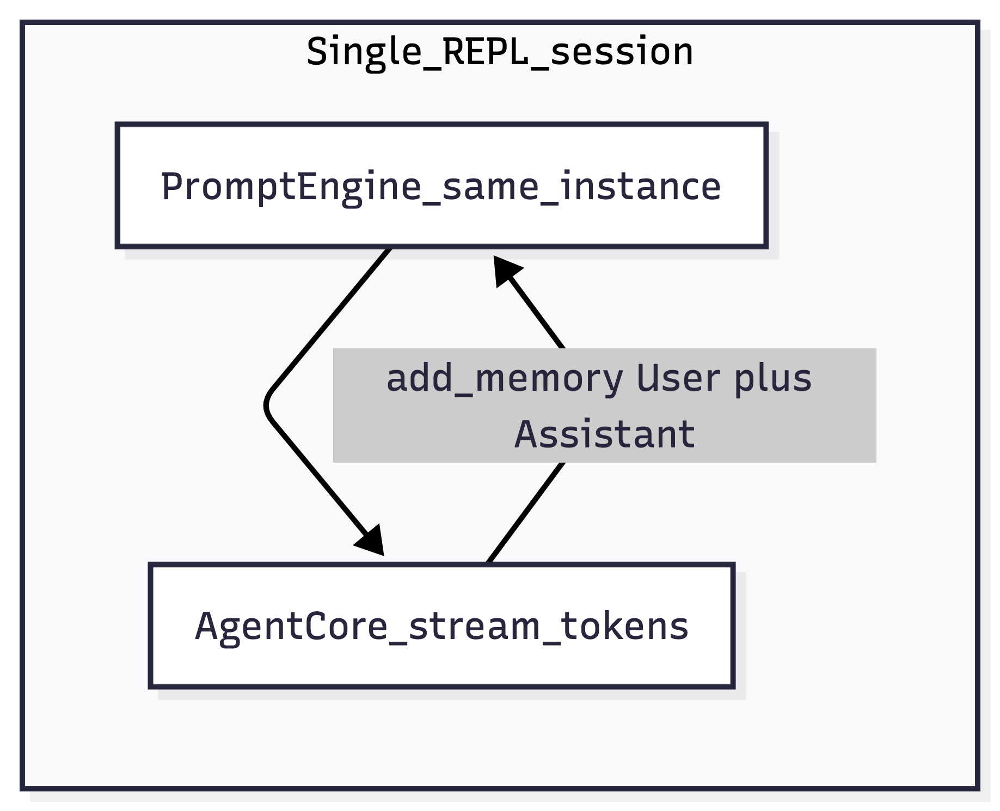

# Voice Interviewer

## Purpose

**Voice interviewer** is the **smallest** chapter-09 capstone: a **text-only** REPL where you play the **candidate** and the model plays a **hiring manager** conducting a **behavioral interview**. The learning goal is **conversation memory without extra state variables**:

- You keep **one** [`PromptEngine`](../../src/voice_agents/agent/prompt_engine.py) instance for the whole session.
- Every [`AgentCore.stream_tokens`](../../src/voice_agents/agent/agent_core.py) call passes that same `engine`.
- When a stream finishes, **`AgentCore`** appends **`User:`** / **`Assistant:`** lines to **`engine.memory_lines`**.
- On the **next** turn, [`build_user_message`](../../src/voice_agents/agent/prompt_engine.py) wraps your new line with a **“Context from earlier in the conversation”** prefix built from those memory lines.

So the “interviewer remembers” not because of a bespoke `history: list[tuple[str,str]]` in this file, but because **`PromptEngine` + `AgentCore`** were designed to work together that way (same pattern as [`04_agent_core/memory/memory.py`](../../04_agent_core/memory/memory.py)).

**Deliberate contrast:** this script is the **only** chapter-09 sample that still uses the **small Qwen2.5** GGUF from chapter 00 and **`chat_template="qwen25"`**. The other capstones resolve a **Llama 3 instruct** file via [`llama_gguf.py`](../llama_gguf.py). That makes it easy to compare **templates** and model size vs quality in one repo.



---

## Run

```bash
uv run python 09_projects/voice_interviewer/voice_interviewer.py
```

After **`Candidate`**, type your answer. **Empty line**, **`quit`**, or **`exit`** stops the loop.

On exit, the script prints how many **`memory_lines`** accumulated so you can sanity-check growth across turns.

---

## Prerequisites

| Requirement | Details |
|-------------|---------|
| Qwen GGUF at `models/llm/qwen2.5-0.5b-instruct-q4_k_m.gguf` | From [`00_start_here/download_models.py`](../../00_start_here/download_models.py). |
| Repo root | Run with `uv run python …` so `voice_agents` imports work. |

No Whisper/Kokoro - by design - so you can focus on **memory + streaming** without audio drivers.

---

## Dependencies

| Piece | Role |
|--------|------|
| [`stream_reply_to_console`](../stream_util.py) | Prints streamed tokens; discards return value here (memory still updated inside `AgentCore`). |
| `AgentCore(..., chat_template="qwen25")` | Uses `qwen25_chat_prompt` + Qwen stop tokens - see [`agent_core.py`](../../src/voice_agents/agent/agent_core.py). |
| `PromptEngine` | `system_prompt` sets interviewer persona; `memory_lines` accumulate. |

---

## Code walkthrough

### 1. Fixed path to the chapter-00 Qwen file

```25:27:09_projects/voice_interviewer/voice_interviewer.py
ROOT = Path(__file__).resolve().parents[2]
LLM = ROOT / "models" / "llm" / "qwen2.5-0.5b-instruct-q4_k_m.gguf"
```

If the file is missing, **`main`** exits early with a clear message - no automatic download in this script.

---

### 2. One engine for the entire interview

```35:42:09_projects/voice_interviewer/voice_interviewer.py
    agent = AgentCore(model_path=str(LLM), chat_template="qwen25")
    engine = PromptEngine(
        system_prompt=(
            "You are a hiring manager running a behavioral interview. "
            "Ask one focused follow-up at a time. Use earlier turns to dig deeper, "
            "not to repeat questions."
        )
    )
```

**Anti-pattern to avoid:** `engine = PromptEngine(...)` **inside** the `while` loop would reset memory every turn and the interviewer would act like amnesia.

**Persona engineering:** the system text encodes **one question at a time** and **use prior answers**. Small models may still ramble or repeat; tightening the system prompt or lowering `max_tokens` is the first knob.

---

### 3. Main loop: `Prompt.ask` + streaming

```47:58:09_projects/voice_interviewer/voice_interviewer.py
    while True:
        user = Prompt.ask("Candidate")
        if not user.strip() or user.strip().lower() in {"quit", "exit"}:
            break
        stream_reply_to_console(
            agent,
            user,
            engine=engine,
            console=console,
            max_tokens=200,
            bold_label="Interviewer",
        )
```

**`stream_reply_to_console`** (see [`stream_util.py`](../stream_util.py)) iterates `agent.stream_tokens(...)`, prints each piece, then returns the full string. **Memory updates happen inside `stream_tokens`** after the stream completes - you do not need to call `add_memory` yourself in this script.

---

### 4. What actually lands in `memory_lines`

After each successful stream, [`AgentCore.stream_tokens`](../../src/voice_agents/agent/agent_core.py) does the moral equivalent of:

- `engine.add_memory(f"User: {user_text}")`
- `engine.add_memory(f"Assistant: {full_reply}")`

And `PromptEngine.add_memory` **truncates** to the last **20** lines to cap prompt growth:

```13:16:src/voice_agents/agent/prompt_engine.py
    def add_memory(self, line: str) -> None:
        self.memory_lines.append(line)
        if len(self.memory_lines) > 20:
            self.memory_lines = self.memory_lines[-20:]
```

So “long interviews” stay bounded; for a production system you might **summarize** old turns instead of hard truncation.

---

### 5. Exit summary

```59:62:09_projects/voice_interviewer/voice_interviewer.py
    console.print(
        f"\n[dim]Lines in PromptEngine.memory_lines: {len(engine.memory_lines)} "
        f"(user + assistant alternation from AgentCore).[/]"
    )
```

**Rough expectation:** each completed Q/A adds **two** lines. If you exited before any reply finished, counts may be lower.

---

## Adding audio (exercise bridge to chapter 05)

This file is text-only so the **memory mechanism** stays visible. A natural extension:

1. Replace **`Prompt.ask`** with **`record_seconds`** + **`transcribe_samples`** (same as [`voice_tutor`](../voice_tutor/voice_tutor.py)).
2. Optionally add **Kokoro** playback of the interviewer reply (stream tokens into sentence chunks, or play one `complete`).

You would still keep **one** `PromptEngine` so the **STT text** participates in the same memory model as typed text.

---

## Failure modes

| Symptom | Likely cause |
|---------|----------------|
| `Download models first` | Missing Qwen GGUF path |
| Interviewer ignores earlier answers | Model too small to follow long context; truncation at 20 lines; try shorter answers or larger model |
| Garbled streaming | Terminal width / Rich; not a logic bug - try fewer Unicode symbols in prompts |

---

## Comparison to other chapter-09 projects

| Project | Audio? | LLM | Memory pattern |
|---------|--------|------|------------------|
| **voice_interviewer** | No | Qwen + `qwen25` | Single `PromptEngine`, `stream_util` |
| **voice_tutor** | Yes | Llama instruct | Single `PromptEngine`, local streaming TTS |
| **cli_assistant** | No | Llama instruct | **Two** engines, memory cleared per sub-step |
| **therapist_bot** | No | Llama instruct | One engine, **mutable `system_prompt`** per turn |

---

## Related reading

- [`04_agent_core/memory/CODE.md`](../../04_agent_core/memory/CODE.md)  -  explicit memory demo with `PromptEngine`.
- [`voice_tutor/CODE.md`](../voice_tutor/CODE.md)  -  voice + memory + preload.
