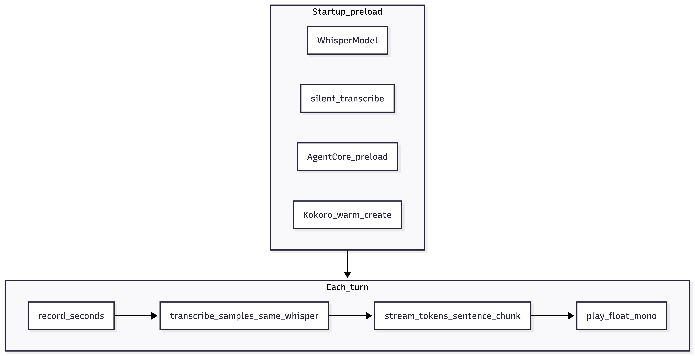

# Voice Tutor

## Purpose

**Voice tutor** is a **multi-turn voice** capstone: each turn you **speak** into the mic (fixed-length recording), **Whisper** turns audio into text, a **streaming LLM** answers with the persona of a patient tutor, and **Kokoro** speaks each **sentence-sized chunk** as soon as enough text has arrived - so you get the same “**streaming TTS**” feel as [`05_full_voice_loop/streaming_voice_agent`](../../05_full_voice_loop/streaming_voice_agent/streaming_voice_agent.py), plus two big product lessons:

1. **Warm-up (“preload”)**  -  the first real user utterance should not pay the full cost of **CTranslate2** first compile, **GGUF mmap**, and **ONNX** session creation. The script loads everything once and runs **cheap dummy work** on each stack layer.
2. **Session memory**  -  one shared [`PromptEngine`](../../src/voice_agents/agent/prompt_engine.py) is passed into every [`AgentCore.stream_tokens`](../../src/voice_agents/agent/agent_core.py) call so the tutor **remembers prior turns** (same idea as [`voice_interviewer`](../voice_interviewer/voice_interviewer.py), but with audio in and audio out).

It uses a **Llama 3.x instruct** GGUF resolved by [`09_projects/llama_gguf.py`](../llama_gguf.py) and `AgentCore(..., chat_template="llama3")`, unlike chapter 05’s default **Qwen** path from chapter 00.



---

## Run

**Default:** multi-turn voice loop until you say **quit**, **exit**, or **goodbye** as the whole transcript (after STT), or **Ctrl+C**.

**One-shot text** (no microphone):

```bash
uv run python 09_projects/voice_tutor/voice_tutor.py
uv run python 09_projects/voice_tutor/voice_tutor.py --seconds 8
uv run python 09_projects/voice_tutor/voice_tutor.py --text "What is a Python list comprehension?"
```

---

## Prerequisites

| Path / setting | Notes |
|----------------|--------|
| `models/kokoro/kokoro-v1.0.onnx` + `voices-v1.0.bin` | Same as chapter 00 / 03 ([`download_models.py`](../../00_start_here/download_models.py)). |
| `models/whisper/` | Used as `download_root` for **faster-whisper** (default `tiny.en` via [`TranscribeConfig`](../../src/voice_agents/stt/streaming_stt.py)). |
| Llama instruct GGUF under `models/llm/` | See [`llama_gguf.py`](../llama_gguf.py); optional helper [`download_llama_8b_instruct_gguf.py`](../download_llama_8b_instruct_gguf.py). |

---

## Dependencies

| Piece | Role |
|--------|------|
| [`record_seconds`](../../src/voice_agents/audio/audio_input.py), [`AudioInputConfig`](../../src/voice_agents/audio/audio_input.py) | Fixed-duration float32 mono capture. |
| [`transcribe_samples`](../../src/voice_agents/stt/streaming_stt.py), **`whisper_model=`** | STT without reconstructing `WhisperModel` every turn. |
| [`AgentCore.stream_tokens`](../../src/voice_agents/agent/agent_core.py) | Token iterator; combined with local buffer for sentence chunking. |
| [`play_float_mono`](../../src/voice_agents/audio/audio_output.py) | Playback with fades (library path, not raw `sounddevice`). |
| **`kokoro_onnx.Kokoro`** | `create` per chunk; voice list via `get_voices()`. |

---

## Code walkthrough

### 1. Paths and sentence boundary regex

```38:43:09_projects/voice_tutor/voice_tutor.py
ROOT = Path(__file__).resolve().parents[2]
WHISPER_ROOT = ROOT / "models" / "whisper"
KOKORO_MODEL = ROOT / "models" / "kokoro" / "kokoro-v1.0.onnx"
KOKORO_VOICES = ROOT / "models" / "kokoro" / "voices-v1.0.bin"

_SENTENCE_END = re.compile(r"([.!?]\s+)")
```

**`parents[2]`** is the **repository root** (script is under `09_projects/voice_tutor/`). The regex matches punctuation **plus following whitespace** so you flush “`Hello.` ” as a unit; compare with chapter 06’s stricter patterns if you want end-of-string punctuation without a trailing space.

---

### 2. `_play_kokoro`: one chunk to speakers

```46:48:09_projects/voice_tutor/voice_tutor.py
def _play_kokoro(k: Kokoro, voice: str, text: str) -> None:
    audio, sr = k.create(text, voice=voice, speed=1.0)
    play_float_mono(audio, int(sr))
```

**Note:** This capstone omits `lang="en-us"` on `create` (chapter 05 sometimes sets it explicitly). If you add non-English content, set the language flag to match Kokoro’s expectations.

---

### 3. `_stream_tutor_to_speakers`: buffer tokens, flush on sentences

```51:77:09_projects/voice_tutor/voice_tutor.py
def _stream_tutor_to_speakers(
    agent: AgentCore,
    engine: PromptEngine,
    k: Kokoro,
    voice: str,
    user_text: str,
    *,
    console: Console,
) -> None:
    buf = ""
    for piece in agent.stream_tokens(user_text, engine=engine, max_tokens=256):
        buf += piece
        while True:
            m = _SENTENCE_END.search(buf)
            if not m:
                break
            chunk = buf[: m.end()].strip()
            buf = buf[m.end() :]
            if chunk:
                _play_kokoro(k, voice, chunk)
        if len(buf) > 200:
            chunk = buf.strip()
            buf = ""
            if chunk:
                _play_kokoro(k, voice, chunk)
    if buf.strip():
        _play_kokoro(k, voice, buf.strip())
```

**Teaching points:**

- **Streaming** is at the **LLM token** level; **TTS** runs on **coarser** units (sentences). That hides LLM “stutter” and avoids calling Kokoro hundreds of times per reply.
- The **`len(buf) > 200`** branch avoids infinite growth if the model never emits `.?!` (e.g. a list or code block).
- After the loop, **`buf.strip()`** plays a trailing fragment without sentence punctuation.

This structure is intentionally parallel to chapter 05’s streaming voice agent so you can **diff** the files and see only **preload**, **Whisper reuse**, **persona**, and **Llama** resolution changed.

---

### 4. `_preload_everything`: why order matters

```80:123:09_projects/voice_tutor/voice_tutor.py
def _preload_everything(
    *,
    console: Console,
    llm_path: Path,
    tcfg: TranscribeConfig,
    audio_cfg: AudioInputConfig,
) -> tuple[AgentCore, PromptEngine, Kokoro, str, WhisperModel]:
    """Load Llama + Whisper + Kokoro once; warm caches so the first real turn is snappier."""
    console.print("[dim]Loading Whisper (tiny.en)…[/]")
    whisper = WhisperModel(
        tcfg.model_size,
        device=tcfg.device,
        compute_type=tcfg.compute_type,
        download_root=tcfg.download_root,
    )
    # Compile / mmap CTranslate2 path once (cheap audio; transcript may be empty).
    warm_audio = np.zeros(int(0.25 * audio_cfg.sample_rate), dtype=np.float32)
    transcribe_samples(
        warm_audio,
        audio_cfg.sample_rate,
        config=tcfg,
        whisper_model=whisper,
    )

    console.print("[dim]Loading Llama (GGUF mmap)…[/]")
    agent = AgentCore(model_path=str(llm_path), chat_template="llama3", n_ctx=8192)
    agent.preload()

    engine = PromptEngine(
        system_prompt=(
            "You are a patient tutor. Give a short explanation then one practice question. "
            "Keep replies under three sentences. Remember what the learner already asked "
            "when they follow up."
        )
    )

    console.print("[dim]Loading Kokoro…[/]")
    k = Kokoro(str(KOKORO_MODEL), str(KOKORO_VOICES))
    voice = "af_heart" if "af_heart" in k.get_voices() else k.get_voices()[0]
    k.create("Hi.", voice=voice, speed=1.0)
```

| Step | What latency it hides |
|------|------------------------|
| **WhisperModel** ctor | Model download / mmap if first time |
| **`transcribe_samples(..., whisper_model=whisper)`** on silence | Graph compile / batching warmup inside faster-whisper |
| **`agent.preload()`** | GGUF mmap and llama.cpp context setup |
| **`k.create("Hi.")`** | ONNX Runtime session and first kernel launch for Kokoro |

Without this, the **first** `record_seconds` after startup would still work, but the user would wait longer **after** they finish speaking.

---

### 5. One `PromptEngine` for the whole session

```108:114:09_projects/voice_tutor/voice_tutor.py
    engine = PromptEngine(
        system_prompt=(
            "You are a patient tutor. Give a short explanation then one practice question. "
            "Keep replies under three sentences. Remember what the learner already asked "
            "when they follow up."
        )
    )
```

**After each `stream_tokens` completes**, [`AgentCore`](../../src/voice_agents/agent/agent_core.py) appends **`User:`** and **`Assistant:`** lines to **`engine.memory_lines`**. The next turn’s prompt is built via [`build_user_message`](../../src/voice_agents/agent/prompt_engine.py), which injects a **“Context from earlier in the conversation”** block. So the “memory” is not a separate list in this script - it is exactly the **`PromptEngine`** state.

---

### 6. Main loop: `--text` vs voice

- **`--text`:** one `_stream_tutor_to_speakers` call and **`return`** (no mic).
- **Voice:** `while True` increments **`turn`**, records **`args.seconds`**, transcribes with the **same** `whisper` instance, skips empty STT, treats **quit** / **exit** / **goodbye** as stop words on the **transcript** (so STT must recognize them).

```180:196:09_projects/voice_tutor/voice_tutor.py
    turn = 0
    while True:
        turn += 1
        console.print(f"\n[dim]Turn {turn}  -  recording {args.seconds:g} s… speak now.[/]")
        audio, sr = record_seconds(args.seconds, config=audio_cfg)
        text = transcribe_samples(audio, sr, config=tcfg, whisper_model=whisper).strip()
        console.print("[bold]You:[/]", text or "[dim](no speech detected)[/]")
        if not text:
            console.print("[dim]Try again, or say quit to leave.[/]")
            continue
        low = text.lower()
        if low in {"quit", "exit", "goodbye"}:
            console.print("[dim]Bye![/]")
            break

        console.print("[dim]Tutor (streaming)…[/]")
        _stream_tutor_to_speakers(agent, engine, k, voice, text, console=console)
```

**Design limitation (intentional simplicity):** stop phrases are detected only on **full transcript equality** after lowercasing, not as substrings. Saying “I want to quit now” will **not** exit; that would need substring or intent detection.

---

## Comparison to chapter 05 streaming agent

| Topic | Chapter 05 `streaming_voice_agent` | This capstone |
|--------|-----------------------------------|----------------|
| LLM | Qwen GGUF from chapter 00 | Llama 3 instruct via `llama_gguf` |
| Whisper | New model per run (implicit) | **Single reused** `WhisperModel` |
| Memory | Effectively single-turn in that script | **Multi-turn** `PromptEngine` |
| Preload | Not emphasized | **Explicit** warm transcribe + `preload()` + Kokoro |

---

## Failure modes and tuning

| Issue | Direction |
|--------|-----------|
| Truncated answers | Raise `max_tokens` in `_stream_tutor_to_speakers` |
| Too much silence in capture | Lower `--seconds` for snappier turns (tradeoff: cut-off speech) |
| Wrong language / poor STT | Larger Whisper model in `TranscribeConfig.model_size` (slower, heavier) |
| Kokoro runaway latency | Fewer, larger chunks (change regex / max buffer) at cost of time-to-first-audio |

---

## Extensions

1. **End-of-utterance:** replace fixed `record_seconds` with [`record_until_silence`](../../src/voice_agents/audio/audio_input.py) (see chapter 06 patterns).
2. **Interruption:** while `_stream_tutor_to_speakers` runs, a background thread could listen for “stop” (advanced; needs careful audio device handling).
3. **Structured tutoring:** ask the LLM for JSON `{explain, question}` and only TTS certain fields (exercise in tool-style parsing without tools).

---

## Related reading

- [`05_full_voice_loop/streaming_voice_agent/CODE.md`](../../05_full_voice_loop/streaming_voice_agent/CODE.md)  -  baseline streaming sentence pipeline.
- [`voice_interviewer/CODE.md`](../voice_interviewer/CODE.md)  -  memory-focused text capstone (no audio).
