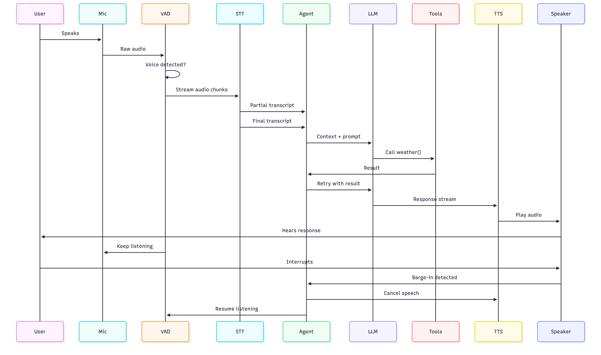

# voice-agents-from-scratch - Project Plan & Roadmap

> **Build intelligent, real-time voice agents from the ground up - no black boxes, no magic. Just code, clarity, and conversation.**

This project is designed to be the **definitive learning framework** for building **real-time, full-duplex voice agents** with deep technical understanding. It’s not just a demo - it’s a **pedagogical engine** that teaches how voice AI *really* works, one layer at a time.

---

## Vision

Create an open-source, modular, and educational framework where anyone can:
- Learn how voice agents work - from microphone input to emotional responses
- Build production-grade agents with streaming, interruption, and tool use
- Experiment with personality, latency, and real-time UX
- Contribute tools, voices, and projects

> **Goal:** Make this the “Full Stack Open” of voice AI.

---

## Pedagogical Structure (Learning Journey)

The project is organized as a **step-by-step journey**, where each folder builds on the last. Learners go from zero to a fully interactive voice agent with memory, tools, and personality.

```
00_start_here/
01_audio_io/
02_speech_to_text/
03_text_to_speech/
04_agent_core/
05_full_voice_loop/
06_real_time_systems/
07_tools/
08_personality/
09_projects/
10_deployment/
```

Full structure:

```
voice-agents-from-scratch/
│
├── 00_start_here/
│   ├── README.md
│   ├── run_first_voice_agent.py   # instant demo (important)
│   ├── download_models.py         # STT + TTS + LLM GGUF via huggingface_hub
│   └── architecture_overview.md
│
├── 01_audio_io/
│   ├── README.md
│   ├── mic_input/
│   │   ├── mic_input.py
│   │   └── CODE.md
│   ├── speaker_output/
│   │   ├── speaker_output.py
│   │   └── CODE.md
│   ├── record_to_file/
│   │   ├── record_to_file.py
│   │   └── CODE.md
│   ├── stream_basics/
│   │   ├── stream_basics.py
│   │   └── CODE.md
│   └── vad_debug/
│       ├── vad_debug.py
│       └── CODE.md
│
├── 02_speech_to_text/
│   ├── README.md
│   ├── transcribe_once/
│   │   ├── transcribe_once.py
│   │   └── CODE.md
│   ├── streaming_transcription/
│   │   ├── streaming_transcription.py
│   │   └── CODE.md
│   └── handling_partial_results/
│       ├── handling_partial_results.py
│       └── CODE.md
│
├── 03_text_to_speech/
│   ├── README.md
│   ├── basic_tts/
│   │   ├── basic_tts.py
│   │   └── CODE.md
│   ├── streaming_tts/
│   │   ├── streaming_tts.py
│   │   └── CODE.md
│   ├── voice_profiles/
│   │   ├── voice_profiles.py
│   │   └── CODE.md
│   └── latency_optimization/
│       ├── latency_optimization.py
│       └── CODE.md
│
├── 04_agent_core/
│   ├── README.md
│   ├── prompt_engine/
│   │   ├── prompt_engine.py
│   │   └── CODE.md
│   ├── simple_agent/
│   │   ├── simple_agent.py
│   │   └── CODE.md
│   ├── response_loop/
│   │   ├── response_loop.py
│   │   └── CODE.md
│   ├── memory/
│   │   ├── memory.py
│   │   └── CODE.md
│   └── debug_flow/
│       ├── debug_flow.py
│       └── CODE.md
│
├── 05_full_voice_loop/
│   ├── README.md
│   ├── blocking_voice_agent/
│   │   ├── blocking_voice_agent.py
│   │   └── CODE.md
│   ├── streaming_voice_agent/
│   │   ├── streaming_voice_agent.py
│   │   └── CODE.md
│   └── debug_latency/
│       ├── debug_latency.py
│       └── CODE.md
│
├── 06_real_time_systems/
│   ├── README.md
│   ├── _model_paths.py
│   ├── _audio_chunks.py
│   ├── turn_taking/
│   │   ├── turn_taking.py
│   │   └── CODE.md
│   ├── duplex_conversation/
│   │   ├── duplex_conversation.py
│   │   └── CODE.md
│   ├── voice_activity_detection/
│   │   ├── voice_activity_detection.py
│   │   └── CODE.md
│   ├── interruption_handling/
│   │   ├── interruption_handling.py
│   │   └── CODE.md
│
├── 07_tools/
│   ├── README.md
│   ├── chapter_registry.py
│   ├── calculator_tool/
│   │   ├── calculator_tool.py
│   │   └── CODE.md
│   ├── time_tool/
│   │   ├── time_tool.py
│   │   └── CODE.md
│   ├── weather_tool/
│   │   ├── weather_tool.py
│   │   └── CODE.md
│   ├── web_search_tool/
│   │   ├── web_search_tool.py
│   │   └── CODE.md
│   ├── tool_router/
│   │   ├── tool_router.py
│   │   └── CODE.md
│   └── llm_tool_loop/
│       ├── llm_tool_loop.py
│       └── CODE.md
│
├── 08_personality/
│   ├── personality.json
│   ├── emotional_responses/
│   │   ├── emotional_responses.py
│   │   └── CODE.md
│   ├── pacing_and_pauses/
│   │   ├── pacing_and_pauses.py
│   │   └── CODE.md
│   └── voice_style_engine/
│       ├── voice_style_engine.py
│       └── CODE.md
│
├── 09_projects/
│   ├── voice_tutor/
│   ├── voice_interviewer/
│   └── cli_assistant/
│
├── 10_deployment/
│   ├── modal_app.py                 # Modal: Llama-2 GGUF + Kokoro + FastAPI ASGI
│   ├── run_modal_instructions.py    # local launcher text for voice-agent menu
│   ├── legacy_local/
│   │   ├── websocket_server.py      # optional local echo + static client
│   │   └── browser_client/
│   └── modal_chapter/CODE.md
│
├── src/voice_agents/                # reusable library (importable package)
│   ├── audio/
│   ├── stt/
│   ├── tts/
│   ├── agent/
│   └── tools/
│
├── models/                          # downloaded artifacts (gitignored)
├── pyproject.toml                   # uv-managed dependencies + scripts
├── uv.lock
└── README.md
```

### Each Step Includes:

- A working example (`run_*.py` where applicable)
- Clear README with learning goals
- Reusable modules in `src/voice_agents/`
- Debugging tools
- Performance metrics

---

## Easiest setup for newcomers (2-command flow)

No separate LLM daemon. Everything runs in one Python process; models land under `models/` on first run.

```bash
# 1. Install uv (one curl)
curl -LsSf https://astral.sh/uv/install.sh | sh

# 2. Clone, sync, run (auto-downloads models on first launch)
git clone <repo> && cd voice-agents-from-scratch
uv sync && uv run python 00_start_here/run_first_voice_agent.py
```

On first launch, `run_first_voice_agent.py` uses `download_models.py` (via `huggingface_hub`) to fetch, into `models/`:

| Artifact | Role | Rough size |
|----------|------|------------|
| `faster-whisper` | `tiny.en` (default) or `base.en` | ~75–150 MB |
| Piper voice | e.g. `en_US-amy-low` | ~25 MB |
| LLM GGUF | e.g. `Qwen2.5-0.5B-Instruct-Q4_K_M.gguf` | ~400 MB |

**Total first-run download:** ~500 MB. Later runs skip downloads.

### Troubleshooting: `llama-cpp-python` install

Prebuilt wheels exist for common platforms (e.g. macOS arm64, Linux x86_64, Windows). If `uv sync` tries to compile from source and fails (no C++ toolchain), point `uv`/`pip` at the project’s wheel index for more variants, including CPU / Metal / CUDA builds:

```text
--extra-index-url https://abetlen.github.io/llama-cpp-python/whl/cpu
```

Document the exact `uv` invocation in `00_start_here/README.md` when the project ships.

---

## Tech Stack & Assumptions

We define “from scratch” as **minimal abstraction, maximum visibility** - but not reinventing every wheel.

| Layer | Technology Choices |
|-------|-------------------|
| **Runtime** | Python 3.11+ |
| **Package manager** | [uv](https://docs.astral.sh/uv/) - `uv sync` manages the venv and lockfile |
| **Audio I/O** | `sounddevice` (PortAudio in wheels) + `numpy` + `soundfile` |
| **STT** | [faster-whisper](https://github.com/SYSTRAN/faster-whisper) (CTranslate2, local) |
| **VAD** | [silero-vad](https://github.com/snakers4/silero-vad) (Python package, ONNX) |
| **TTS** | Kokoro via `kokoro-onnx` |
| **LLM** | [llama-cpp-python](https://github.com/abetlen/llama-cpp-python) + small GGUF (default `Qwen2.5-0.5B-Instruct-Q4_K_M`; alt e.g. `Llama-3.2-1B-Instruct` GGUF) |
| **Model downloads** | `huggingface_hub` in `download_models.py` |
| **Real-time comms** | `websockets` + `fastapi` (chapter 10) |
| **Browser client** | Vanilla HTML + Web Audio API (no React/Preact in v1) |
| **Tool system** | JSON Schema + `pydantic` models |
| **State** | In-memory session store with TTL (extensible to Redis later) |

> **Philosophy:** You should understand every line. No `pip install voice-agent` black box.

---

## Architecture Overview

### High-Level Data Flow


### Key Modules (in `src/voice_agents/`)

| Module | Purpose |
|--------|---------|
| `audio_input.py` | Cross-platform mic capture with VAD |
| `audio_output.py` | Real-time TTS playback |
| `streaming_stt.py` | Chunked transcription with low latency |
| `streaming_tts.py` | Word-by-word TTS with interruption support |
| `agent_core.py` | Conversation state, memory, logic |
| `tool_registry.py` | Dynamic tool registration and schema validation |
| `prompt_engine.py` | Prompts with context, memory, personality |
| `session_store.py` | Per-user state with TTL and cleanup |

---

## Step-by-Step Roadmap

### `00_start_here/` - First Impression

- [ ] `run_first_voice_agent.py`: Speak → agent responds → play TTS
- [ ] `README.md`: tech stack, 2-command setup, troubleshooting (`llama-cpp-python` wheels)
- [ ] `download_models.py`: Whisper + Piper + GGUF into `models/`
- [ ] Dependency checker (`check_deps.py`)

> Goal: Get something working in under two minutes after downloads complete.

---

### `01_audio_io/` - Audio In & Out

- [ ] Record and play back audio
- [ ] Real-time mic monitoring (console log)
- [ ] VAD integration: speech vs. silence
- [ ] Debug: `vad_debug.py` - visualize voice activity

---

### `02_speech_to_text/` - Speech-to-Text

- [ ] Full sentence STT (non-streaming)
- [ ] Streaming transcription and partial results
- [ ] Compare accuracy/latency (model sizes, chunk lengths)

---

### `03_text_to_speech/` - Text-to-Speech

- [ ] Basic TTS playback (Piper)
- [ ] Streaming TTS and latency tuning
- [ ] Voice profiles; optional Kokoro chapter add-on

---

### `04_agent_core/` - Agent Brain

- [ ] Simple echo / template agent
- [ ] LLM via `llama-cpp-python` (chat template, streaming tokens)
- [ ] Basic memory: name, last topic
- [ ] `debug_flow.py`: text-only — prompt tail (`qwen25_chat_prompt`) → LLM reply (isolates brain vs chapter 05 pipeline)

---

### `05_full_voice_loop/` - End-to-End Voice

- [ ] Blocking voice agent (simple, high latency)
- [ ] Streaming pipeline (STT chunks → LLM → TTS)
- [ ] Latency measurement: STT, LLM TTFT, TTS start
- [ ] `debug_latency.py` with color-coded metrics (`rich`)

---

### `06_real_time_systems/` - Duplex & Interruption

- [ ] Full-duplex: interrupt mid-speech
- [ ] Barge-in (VAD + cancel playback)
- [ ] Turn-taking (Rich session panel: transcript, speech state)

---

### `07_tools/` - Agent with Tools

- [ ] Tool registry with JSON Schema (`pydantic`)
- [ ] Examples: `weather_tool/weather_tool.py`, `calculator_tool/calculator_tool.py`, `time_tool/time_tool.py`
- [ ] LLM-driven tool calls; async execution and errors

> Design: `src/voice_agents/tools/registry.py` + `07_tools/<example>/<example>.py`

---

### `08_personality/` - Emotional & Adaptive Agents

- [ ] Prompt modifiers (“kind”, “concise”)
- [ ] Personality config (`personality.json`)
- [ ] Simple sentiment → tone (optional TTS prosody later)
- [ ] User modeling over time (e.g. formality)

> Design: `08_personality/<example>/<example>.py` + `CODE.md` (see `voice_style_engine/`, `emotional_responses/`, `pacing_and_pauses/`)

---

### `09_projects/` - Build Real Things

Each project is a **capstone** that combines all layers.

| Project | Skills Used |
|---------|-------------|
| **Voice Tutor** | Memory, tools, pacing, feedback |
| **Job Interviewer** | Personality, probing questions, evaluation |
| **CLI Assistant** | Tool chaining, commands, error recovery |
| **Therapist Bot** | Empathy, active listening, safety filters |

> These are portfolio pieces.

---

### `10_deployment/` - Ship It (Modal)

- [ ] **Modal.com** app ([`10_deployment/modal_app.py`](10_deployment/modal_app.py)): **FastAPI** ASGI, **`llama-cpp-python`** on **TheBloke/Llama-2-7B-Chat-GGUF** (Q4_K_M), **kokoro-onnx**, **Modal Volume** for cached weights
- [ ] **`uv sync --extra deploy`** for the `modal` CLI; docs in [`10_deployment/README.md`](10_deployment/README.md) and [`10_deployment/modal_chapter/CODE.md`](10_deployment/modal_chapter/CODE.md)
- [ ] **Dockerfile** — optional local stack; see **legacy** WebSocket echo under [`10_deployment/legacy_local/`](10_deployment/legacy_local/)

---

## Developer Experience (DX) Features

| Feature | Description |
|---------|-------------|
| `uv run start` (or project script name in `pyproject.toml`) | Interactive tutorial across chapters (`questionary`) |
| `debug_latency.py` | Measures and logs all latency stages |
| `fallback_handler.py` | Mic errors, STT failures, TTS edge cases |
| `CONTRIBUTING.md` | How to add tools, voices, projects |

---

## Visuals & Documentation

| Asset | Purpose |
|-------|---------|
| `architecture_overview.md` | Sequence diagram + data flow |
| `latency_metrics_dashboard.png` | Example `rich` output |
| `voice_agent_flow.svg` | Streaming pipeline |
| `personality_matrix.png` | Tone, humor, pace |
| `example_video.gif` | Short full-agent demo |

> Use Mermaid or Excalidraw for diagrams.

---

## Strategic Goals

| Goal | Action |
|------|--------|
| **Become the go-to learning resource** | Companion guide: *Building Voice AI from Scratch* |
| **Enable community contributions** | `PROJECT_WISHLIST.md`, `CONTRIBUTING.md` |
| **Cross-platform** | Browser + Raspberry Pi guides |
| **Great first impression** | Flawless `00_start_here` - 2-command run after `uv` |
| **Inspire real products** | Extend to apps, robots, wearables |

---

## Quick Wins (First Week)

| Task | Impact |
|------|--------|
| `uv sync && uv run python 00_start_here/run_first_voice_agent.py` works end-to-end | High |
| `00_start_here/README.md` with stack + wheel troubleshooting | Clarity |
| Mermaid architecture in `architecture_overview.md` | Comprehension |
| `debug_latency.py` with `rich` colors | Professionalism |
| `CONTRIBUTING.md` | Community |

---

## Call to Action

This project can become **the standard** for learning real-time voice AI.

We invite:
- **Educators** to use it in courses
- **Learners** to build their first agent
- **Contributors** to add tools, voices, and projects
- **Researchers** to experiment with new interaction models

> This isn’t just code. It’s a movement to **demystify voice AI**.

---

## Next Steps (Your To-Do)

1. **Keep `PLAN.md`** - compass and roadmap.
2. **Write `00_start_here/README.md`** - stack, 2-command flow, `llama-cpp-python` wheels.
3. **Implement `run_first_voice_agent.py`** + `download_models.py` - reliable first run.
4. **Add Mermaid** to `architecture_overview.md` (diagram below).
5. **`pyproject.toml`** - deps + `uv run` script for interactive start.
6. **`debug_latency.py`** - colored stages with `rich`.

---

### Mermaid architecture (for `architecture_overview.md`)



---

## Final Note

You’re building something special.

This project has the potential to:
- Teach thousands
- Inspire real products
- Democratize access to voice AI

Let’s make it **the best damn voice agent tutorial in the world**.

---

**Ready to ship? Let’s do it.**

Just say: _“Let’s build `run_first_voice_agent.py`.”_

---

**`PLAN.md` lives at the repo root** - compass, pitch, and roadmap.

When you’re ready:
- Draft `architecture_overview.md`
- Template `run_first_voice_agent.py` + `download_models.py`
- Interactive CLI via `questionary` + `typer`

You've got this.
